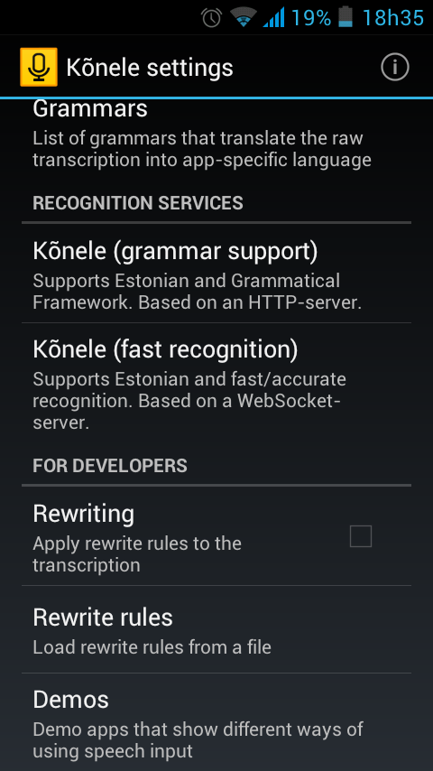
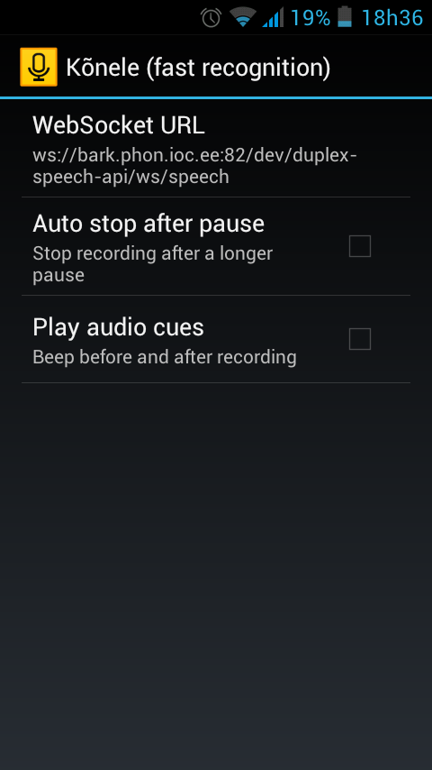
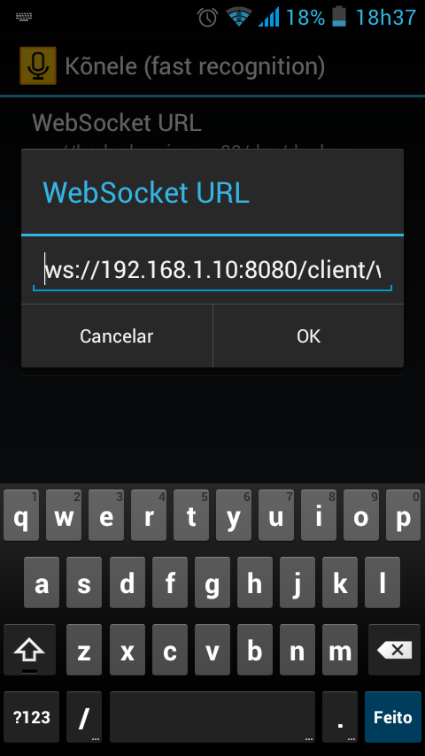
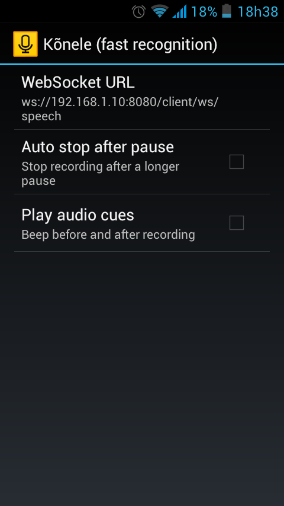
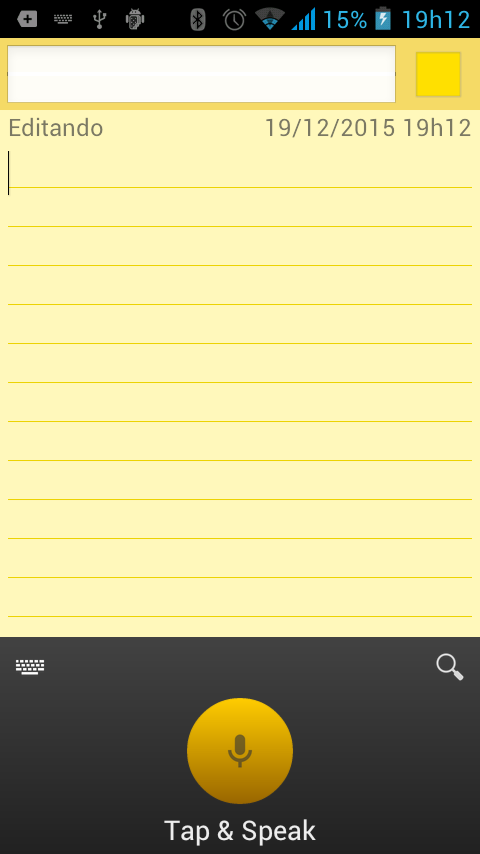
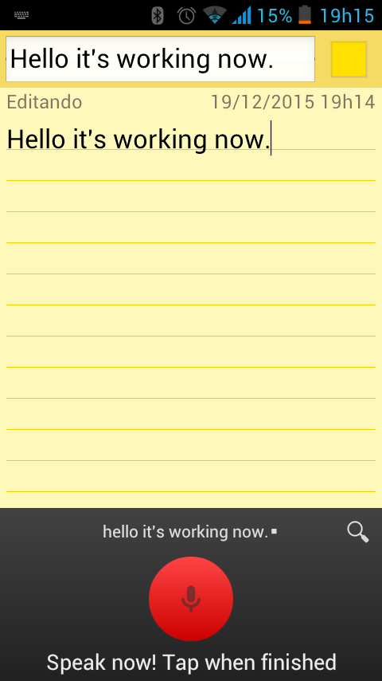

# docker-kaldi-gstreamer-server
Dockerfile for [kaldi-gstreamer-server](https://github.com/alumae/kaldi-gstreamer-server).

Synopsis
--------

This dockerfile automatically builds master and worker servers that are explained at [Full-duplex Speech-to-text System for Estonian](http://ebooks.iospress.nl/volumearticle/37996) from Tanel Alumäe and implemented by himself at https://github.com/alumae/kaldi-gstreamer-server.

Using this project you will be able to run an automatic speech recognition (ASR) server in a few minutes.

Attention
---------

The ASR server that will be set up here requires some [kaldi models](http://www.kaldi.org). In the docker image I will detail below, there are no kaldi models included.

You must have these models on your machine. You must also have an yaml file describing these models. Please, check some examples [here](https://github.com/alumae/kaldi-gstreamer-server/blob/master/sample_worker.yaml), [here](https://github.com/alumae/kaldi-gstreamer-server/blob/master/estonian_worker.yaml) and [here](https://github.com/alumae/kaldi-gstreamer-server/blob/master/sample_english_nnet2.yaml) to find out how to write your own yaml files.

There are some kaldi models available for download. I have tested my setup with this [one](https://phon.ioc.ee/~tanela/tedlium_nnet_ms_sp_online.tgz), which is for English. I'm trying to build a model for Brazilian Portuguese, but until now I didn't find enough free/open resources.


Install docker
--------------

Please, refer to https://docs.docker.com/engine/installation/.


Get the image
-------------

* Pull the image from Docker Hub (~ 900MB):

`docker pull jcsilva/docker-kaldi-gstreamer-server`

* Or you may build your own image (requires git):

`docker build -t kaldi-gstreamer-server:1.0 https://github.com/jcsilva/docker-kaldi-gstreamer-server.git`

In the next sections I'll assume you pulled the image from Docker Hub. If you have built your own image, simply change *jcsilva/docker-kaldi-gstreamer-server:latest* by your image name when appropriate.


How to use
----------

It's possible to use the same docker in two scenarios. You may create the master and worker on the same host machine. Or you can create just a worker and connect it to an already existing master. These two situations are explained below. 

* Instantiate master server and worker server on the same machine:

Assuming that your kaldi models are located at /media/kaldi_models on your host machine, create a container:

```
docker run -it -p 8080:80 -v /media/kaldi_models:/opt/models jcsilva/docker-kaldi-gstreamer-server:latest /bin/bash
```

And, inside the container, start the service:

```
 /opt/start.sh -y /opt/models/nnet2.yaml
```

You will see that 2 .log files (worker.log and master.log) will be created at /opt of your containter. If everything goes ok, you will see some lines indicating that there is a worker available. In this case, you can go back to your host machine (`Ctrl+P and Ctrl+Q` on the container). Your ASR service will be listening on port 8080.

For stopping the servers, you may execute the following command inside your container:
```
 /opt/stop.sh
```

* Instantiate a worker server and connect it to a remote master:

Assuming that your kaldi models are located at /media/kaldi_models on your host machine, create a container:

```
docker run -it -v /media/kaldi_models:/opt/models jcsilva/docker-kaldi-gstreamer-server:latest /bin/bash
```

And, inside the container, start the service:

```
/opt/start.sh -y /opt/models/nnet2.yaml -m master-server.com -p 8888
```

It instantiates a worker on your local host and connects it to a master server located at master-server.com:8888. 

You will see that a worker.log file will be created at /opt of your container. If everything goes ok, you will see some lines indicating that there is a worker available.

For stopping the worker server, you may execute the following command inside your container:
```
 /opt/stop.sh
```

Testing
-------

First of all, please, check if your setup is ok. It can be done using your browser following these steps:

1. Open a websocket client in your browser (e.g: [Simple-WebSocket-Client](https://github.com/hakobera/Simple-WebSocket-Client) or http://www.websocket.org/echo.html).
 
2. Connect to your master server: `ws://MASTER_SERVER/client/ws/status`. If your master is on local host port 8080, you can try: `ws://localhost:8080/client/ws/status`.

3. If your setup is ok, the answer is going to be something like: `RESPONSE: {"num_workers_available": 1, "num_requests_processed": 0}`.

After checking the setup, you should test your speech recognition service. For this, there are several options, and the following list gives some ideas:

1. You can download [this client](https://github.com/alumae/kaldi-gstreamer-server/blob/master/kaldigstserver/client.py) for your host machine and execute it. When the master is on the local host, port 8080 and you have a wav file sampled at 16 kHz located at /home/localhost/audio/, you can type: ```python client.py -u ws://localhost:8080/client/ws/speech -r 32000 /home/localhost/audio/sample16k.wav```

2. You can use [Kõnele](http://kaljurand.github.io/K6nele/) for testing the service. It is an Android app that is freely available for downloading at Google Play. You must configure it to use your ASR service. Below you'll find some screenshots that may help you in this configuration. First, you should click on **Kõnele (fast recognition)**. Then, change the **WebSocket URL**. In my case, I connected to a master server located at ws://192.168.1.10:8080/client/ws/speech. After that, open a **notepad-like** application and change your input method to **Kõnele speech keyboard** and you'll see a **yellow button** instead of your traditional keyboard. Press this button and enjoy!



&nbsp;

&nbsp;

&nbsp;

&nbsp;

&nbsp;



3. A Javascript client is available at http://kaljurand.github.io/dictate.js/. You must configure it to use your ASR service.


Practical Example
-----------------

This section describes a tested example. You may repeat all the steps and, in the end, you'll have an english ASR system working on your machine. For this example, I advise you to use a machine with at least 4GB RAM.

On the host machine, we are going to work on the directory /media/kaldi_models. I'll assume you have all permissions necessary to execute the following commands.

1) Download a valid kaldi model:
```
cd /media/kaldi_models
wget https://phon.ioc.ee/~tanela/tedlium_nnet_ms_sp_online.tgz
tar -zxvf tedlium_nnet_ms_sp_online.tgz
```

2) Copy an example yaml file to /media/kaldi_models:
```
wget https://raw.githubusercontent.com/alumae/kaldi-gstreamer-server/master/sample_english_nnet2.yaml -P /media/kaldi_models
```

3) Update file contents:
```
find /media/kaldi_models/ -type f | xargs sed -i 's:test:/opt:g'
sed -i 's:full-post-processor:#full-post-processor:g' /media/kaldi_models/sample_english_nnet2.yaml
```

4) Instantiate master and worker on the same machine:
```
docker run -it -p 8080:80 -v /media/kaldi_models:/opt/models jcsilva/docker-kaldi-gstreamer-server:latest /bin/bash
```

5) Inside the docker container, start the service:
```
/opt/start.sh -y /opt/models/sample_english_nnet2.yaml
```

6) On your host machine, download a client example and test your setup with a given audio:
```
wget https://raw.githubusercontent.com/alumae/kaldi-gstreamer-server/master/kaldigstserver/client.py -P /tmp
wget https://raw.githubusercontent.com/jcsilva/docker-kaldi-gstreamer-server/master/audio/1272-128104-0000.wav -P /tmp
wget https://raw.githubusercontent.com/alumae/kaldi-gstreamer-server/master/test/data/bill_gates-TED.mp3 -P /tmp
python /tmp/client.py -u ws://localhost:8080/client/ws/speech -r 32000 /tmp/1272-128104-0000.wav
python /tmp/client.py -u ws://localhost:8080/client/ws/speech -r 8192 /tmp/bill_gates-TED.mp3
```

OBS: For running the client example, you must install ws4py version 0.3.2. This can be installed using `pip  install --user ws4py==0.3.2`. You may also need simplejson and pyaudio. They may also be installed using pip.

You should get these transcriptions:

* Audio bill_gates-TED.mp3:

and i was a kid the disaster we worry about most was a nuclear war. that's why we had a barrel like this down our basement filled with cans of food and water. when the nuclear attack came we were supposed to go downstairs hunker down and eat out of that barrel. today the grea/opt risk of global catastrophe. doesn't look like this instead it looks like this. if anything kills over ten million people in the next few decades it's most likely to be a highly infectious virus rather than a war. not missiles that microbes now part of the reason for this is that we have invested a huge amount in nuclear deterrence we've actually invested very little in a system to stop an epidemic. we're not ready for the next epidemic.

* Audio 1272-128104-0000.wav:

mr coulter is the apostle of the middle classes and we're glad to welcome his gospel.

Credits
--------
* [kaldi](http://www.kaldi.org)
* [gst-kaldi-nnet2-online](https://github.com/alumae/gst-kaldi-nnet2-online)
* [kaldi-gstreamer-server](https://github.com/alumae/kaldi-gstreamer-server)
* [Kõnele](http://kaljurand.github.io/K6nele/)
